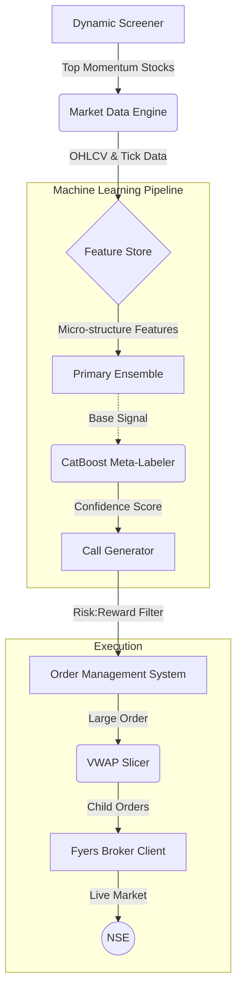

# Institutional-Grade Intraday Quant System (NSE)


An institutional-grade, fully autonomous quantitative trading framework designed for the Indian Stock Market (NSE). Unlike basic retail bots that rely on simple moving averages, this system implements advanced hedge-fund methodologies including **Meta-Labeling**, **Purged Walk-Forward Cross Validation**, **VWAP Execution Algorithms**, and a **Headless Broker Auto-Login**.

---

## 🚀 Key Features

* **Advanced Machine Learning Ensemble:** Utilizes a primary ensemble of `LightGBM` and `XGBoost` classifiers trained on high-fidelity features (Order Flow Imbalance, VPIN, Micro-price Volatility) to detect intraday alpha.
* **CatBoost Meta-Labeler & Conformal Prediction:** Instead of blindly trusting the primary model, a secondary `CatBoost` meta-labeler predicts the *probability of success* of the primary signal. It uses conformal prediction bands to dynamically gate trades based on market regime and uncertainty, effectively filtering out 99% of market noise.
* **Algorithmic Execution (OMS):** Features a robust Order Management System (OMS) utilizing a VWAP (Volume-Weighted Average Price) algorithm. Large institutional-sized orders are intelligently sliced into child orders based on historical intraday U-shaped volume curves to minimize market impact and slippage.
* **Headless Broker Integration:** Fully automated `fyers-apiv3` integration. The system programmatically generates its own TOTP codes (`pyotp`) and bypasses the manual daily OAuth web-login flow, allowing the daemon to run 100% autonomously.
* **Dynamic Pre-Market Screener:** Uses highly parallelized data fetching to scan the entire F&O universe at 09:15 AM, automatically identifying the top "Stocks in Play" based on pre-market gap momentum and relative volume.
* **Institutional Risk Management:** Hardcoded Risk:Reward gating, India VIX volatility filters, and API circuit breakers ensure capital preservation in destructive market conditions.

---

## 🧠 System Architecture



---

## 🛠️ Installation

### Prerequisites
* Python 3.10+
* Microsoft Visual C++ Build Tools (Required for `aiohttp` on Windows)
* An active Fyers Trading Account (for live execution)

### Setup
1. Clone the repository:
   ```bash
   git clone https://github.com/yourusername/intraday-quant-system.git
   cd intraday-quant-system
   ```

2. Create and activate a virtual environment:
   ```bash
   python -m venv .venv
   source .venv/bin/activate  # On Windows use: .venv\Scripts\activate
   ```

3. Install dependencies:
   ```bash
   pip install -r requirements.txt
   ```

4. Configure Environment Variables:
   Create a `.env` file in the root directory and add your Fyers credentials:
   ```ini
   FYERS_APP_ID="YOUR_APP_ID-100"
   FYERS_SECRET_KEY="YOUR_SECRET_KEY"
   FYERS_CLIENT_ID="YOUR_FY_ID"
   FYERS_TOTP_SECRET="YOUR_32_CHAR_BASE32_SECRET"
   FYERS_PIN="1234"
   ```

---

## 💻 Usage

### 1. Live Trading Daemon (Production)
Run the headless live trading daemon. This will automatically authenticate, run the dynamic screener, and enter the live execution tick loop:
```bash
python -m scripts.live_trader --top-n 10
```

### 2. Manual Call Generation (Testing)
Run the core ML pipeline to generate trade calls for the top 5 momentum stocks using the `yfinance` fallback engine (useful for testing without live broker execution):
```bash
python -m scripts.generate_calls --dynamic-screener --top-n 5
```

---

## ⚠️ Disclaimer
This software is for educational and research purposes only. Do not risk money which you are afraid to lose. USE AS AT YOUR OWN RISK. The authors assume no responsibility for your trading results.
